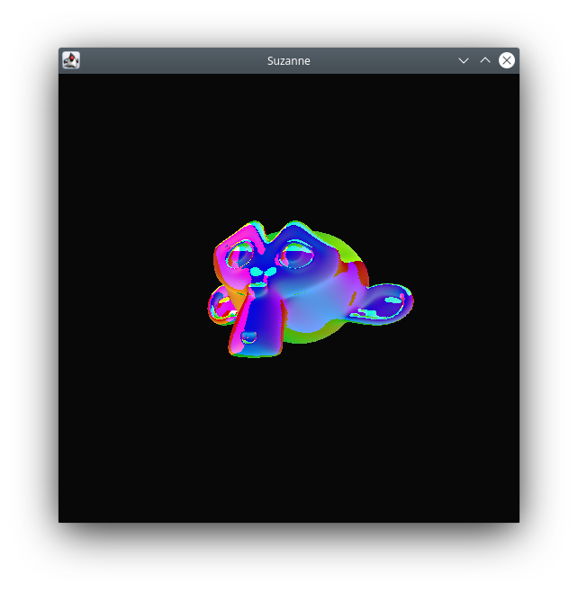

# Fiberlight

3D Rendering Engine written in Java

~~might be changed to C-language later~~
_I'm mentally in a much better place now, thanks for asking_

it's a personal project I'm working on, there are no concerns about serious performance etc., since this is just an experiment.

At the moment it's only supporting the .obj file format.

compiling and running

  $ javac Viewer.java

  $ java Viewer path/to/file.obj
